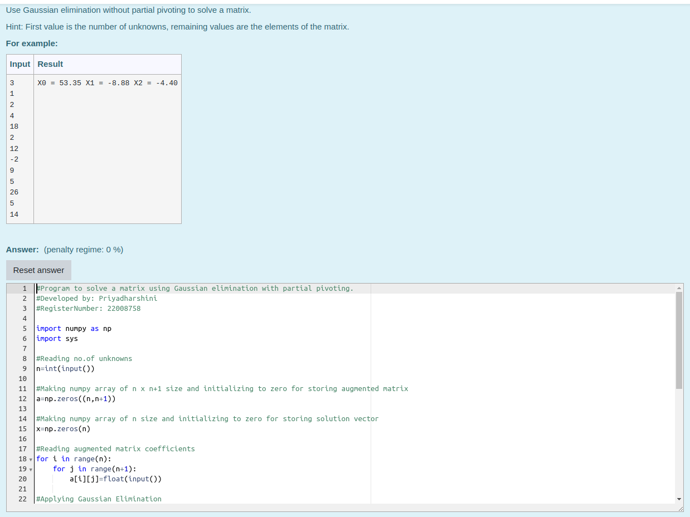
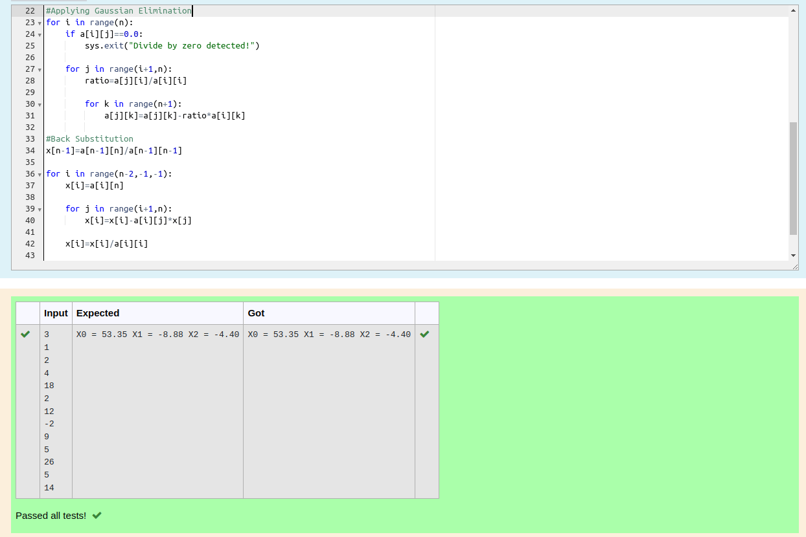
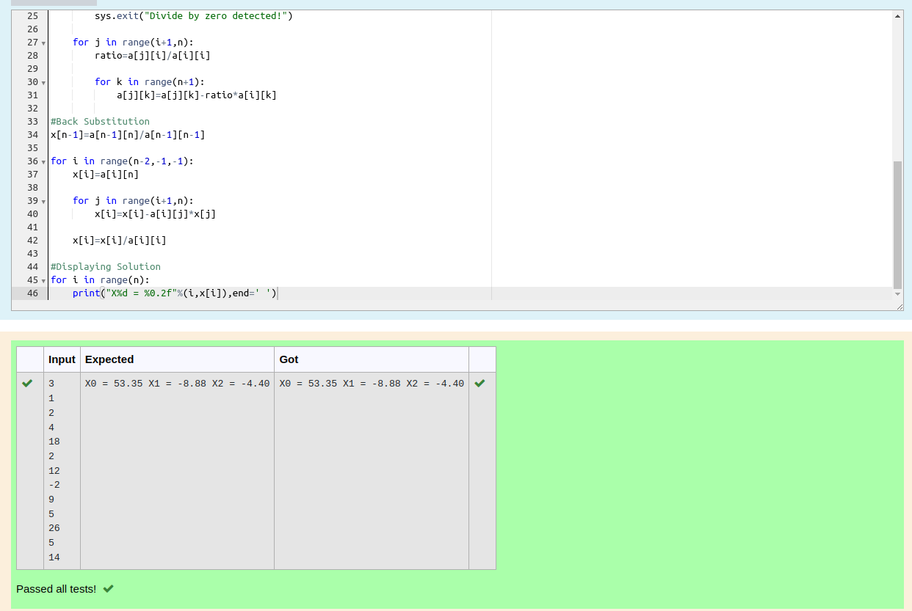

# Gaussian Elimination

## AIM:
To write a program to find the solution of a matrix using Gaussian Elimination.

## Equipments Required:
1. Hardware – PCs
2. Anaconda – Python 3.7 Installation / Moodle-Code Runner

## Algorithm:

### Step 1 :
Import numpy and sys 
### Step 2 :
Get the augmented matrices
### Step 3 :
Apply Gaussian elimination
### Step 4 :
Do back substitution and display the results

## Program:
```
#Program to solve a matrix using Gaussian elimination with partial pivoting.
#Developed by: Priyadharshini
#RegisterNumber: 22008758

import numpy as np
import sys

#Reading no.of unknowns
n=int(input())

#Making numpy array of n x n+1 size and initializing to zero for storing augmented matrix 
a=np.zeros((n,n+1))

#Making numpy array of n size and initializing to zero for storing solution vector
x=np.zeros(n)

#Reading augmented matrix coefficients
for i in range(n):
    for j in range(n+1):
        a[i][j]=float(input())
        
#Applying Gaussian Elimination
for i in range(n):
    if a[i][j]==0.0:
        sys.exit("Divide by zero detected!")
        
    for j in range(i+1,n):
        ratio=a[j][i]/a[i][i]
        
        for k in range(n+1):
            a[j][k]=a[j][k]-ratio*a[i][k]
            
#Back Substitution
x[n-1]=a[n-1][n]/a[n-1][n-1]

for i in range(n-2,-1,-1):
    x[i]=a[i][n]
    
    for j in range(i+1,n):
        x[i]=x[i]-a[i][j]*x[j]
    
    x[i]=x[i]/a[i][i]

#Displaying Solution
for i in range(n):
    print("X%d = %0.2f"%(i,x[i]),end=' ')
```

## Output:





## Result:
Thus the program to find the solution of a matrix using Gaussian Elimination is written and verified using python programming.

